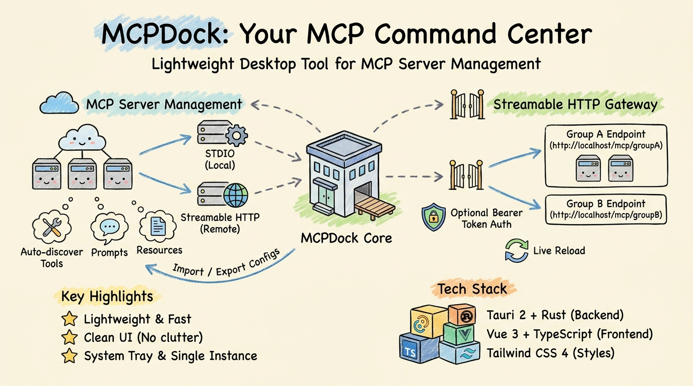
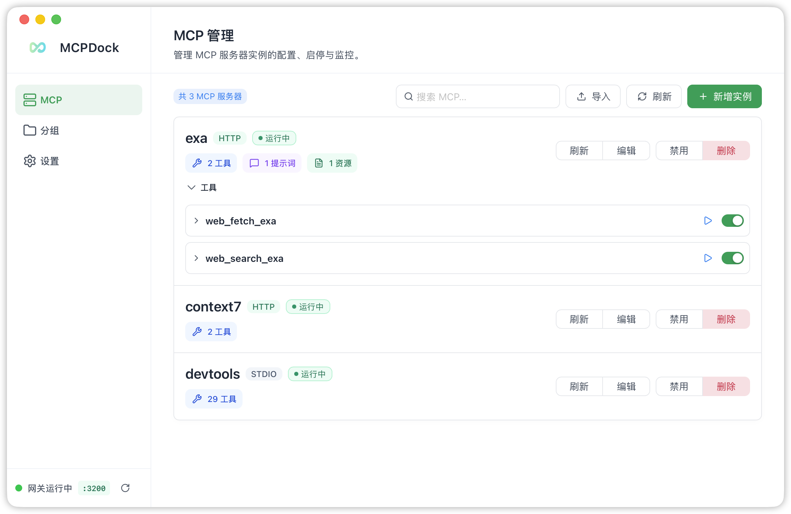
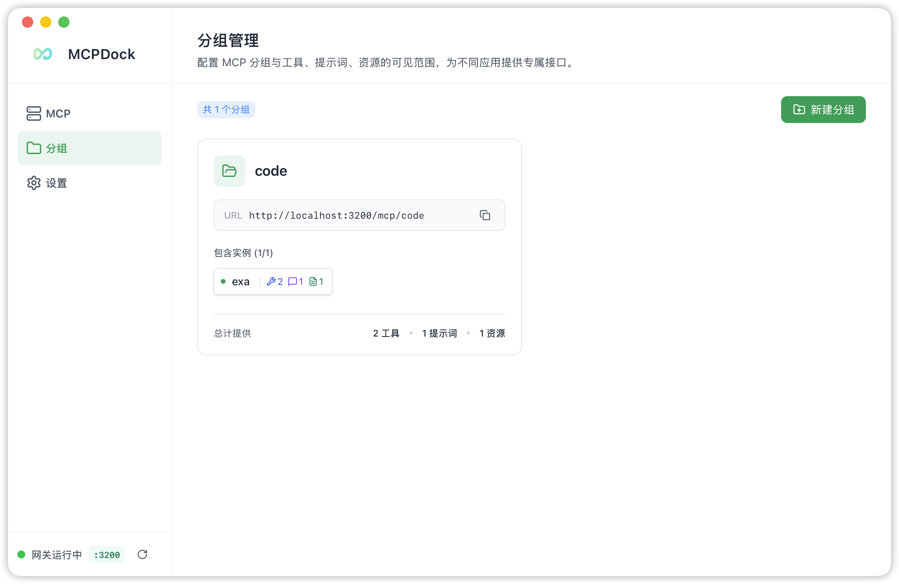
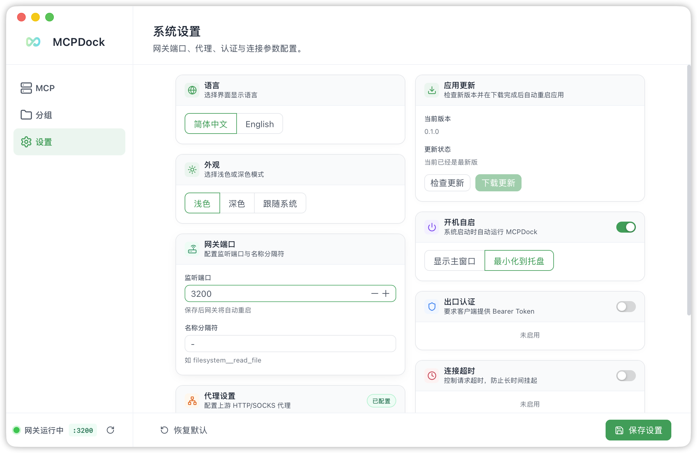
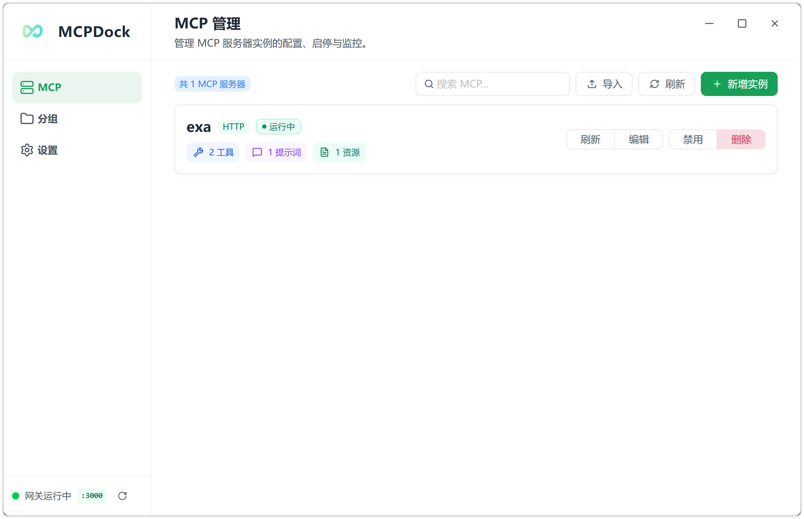

# MCPDock

**[中文](README_zh.md)**

A lightweight, minimal desktop application for managing, monitoring, and exposing MCP (Model Context Protocol) servers. Built with **Tauri 2 + Vue 3 + Rust** — small footprint, fast startup, clean UI.

---

## What is MCPDock?

[MCP](https://modelcontextprotocol.io) is an open protocol that standardizes how applications provide context to LLMs. MCPDock gives you a visual, desktop-native way to:

- Manage all your MCP servers in one place
- Run a local HTTP gateway that aggregates multiple servers into group endpoints
- Discover tools, prompts, and resources automatically
- Import, export, and organize server configurations

Instead of editing JSON files manually, you get a clean, clutter-free UI with system-tray integration, dark mode, and full bilingual support. Designed to stay out of your way.

## Overview



---

## Screenshots

### macOS

**MCP Server Management**

Register STDIO and Streamable HTTP servers, connect/disconnect individually, and monitor status in real time.



**Group & Gateway Management**

Create groups, assign servers, and expose them through dedicated Streamable HTTP endpoints with optional Bearer authentication.



**Settings**

Configure the gateway port, language, tool-name separator, auth token, proxy, timeout, and keep-alive.



### Windows

**MCP Server Management on Windows**



---

## Highlights

- 🪶 **Lightweight** — Native desktop app with a tiny footprint thanks to Tauri 2 and Rust
- ⚡ **Fast** — Near-instant cold start and smooth real-time status updates
- 🧹 **Clean UI** — No distractions, no bloat. Everything is one click away
- 🌐 **Bilingual** — Full Chinese and English support with auto-detection

## Features

### MCP Server Management

- **Add & Configure** — Register MCP servers via two transport types:
  - **STDIO** — Launch a local child process (e.g., `npx`, `python`, `uvx`). Supports command arguments and environment variables.
  - **Streamable HTTP** — Connect to a remote MCP server over HTTP. Supports custom request headers.
- **Connect / Disconnect / Toggle** — Start, stop, or enable/disable servers individually. Enabled servers auto-connect on application launch.
- **Capability Discovery** — After connecting, the app automatically discovers and stores each server's capabilities:
  - **Tools** — invoke from the built-in tool runner
  - **Prompts** — view and call with arguments
  - **Resources & Resource Templates** — static URIs and parameterized URI templates
- **Import / Export** — Batch import servers from JSON, or export your server list for backup and sharing.
- **Search & Filter** — Search servers by name with real-time filtering.
- **Direct Tool Invocation** — Call any discovered tool directly inside the app with a structured input form.

### Streamable HTTP Gateway

- **Group-based endpoint routing** — Each MCP group is exposed as a dedicated Streamable HTTP endpoint at `http://localhost:{port}/mcp/{group_name}`.
- **Optional Bearer Token authentication** — Protect all gateway endpoints with a configurable auth token.
- **Tool name prefixing** — Tools from different servers within a group are prefixed with the server name + configurable separator to avoid naming collisions (e.g., `server__tool_name`).
- **Configurable port** — Choose any available port. Live reloads when settings change or groups are modified.
- **CORS support** — Built-in cross-origin headers for browser-based clients.

### Group Management

- **Multi-server aggregation** — Create groups, assign member MCP servers, and all member tools/prompts/resources are available through the group endpoint.
- **Live reload** — Gateway automatically restarts when groups are created, updated, or deleted.
- **Member toggle** — Quickly add or remove servers from a group without re-creating it.

### Settings

| Setting              | Description                              | Default  |
| -------------------- | ---------------------------------------- | -------- |
| Language             | UI language (Chinese / English / System) | System   |
| Theme                | Light / Dark / System                    | System   |
| Gateway Port         | HTTP listen port for the gateway         | 3000     |
| Separator            | Prefix separator for group tool names    | `__`     |
| Auth Token           | Bearer token for gateway endpoints       | —        |
| Request Timeout      | Connection / tool-call timeout           | 60 s     |
| Keep-alive Interval  | Periodic ping to keep connections alive  | Disabled |
| HTTP Proxy           | Proxy for Streamable HTTP servers        | —        |
| Auto Start           | Launch app on system boot                | Off      |
| Show Window on Start | Show or hide window after auto launch    | Off      |

### System Tray

- Close the window to hide to the system tray rather than exiting.
- Left-click the tray icon or use the tray menu to restore the window.
- macOS: Dock icon hides when window is hidden (Accessory mode).
- Windows: Supports both light and dark tray menu themes.

### Single Instance

- Only one application instance runs at a time. Launching again brings the existing window to the foreground.

### Internationalization

- Full Chinese (zh-CN) and English (en) UI support via `vue-i18n`.
- Language auto-detects from the OS or can be switched manually.

### Appearance

- **Light / Dark / System** theme support with Tailwind CSS 4.
- Native title bar on macOS; custom title-less frame on Windows for a cleaner look.

---

## Tech Stack

| Layer                | Technology                 |
| -------------------- | -------------------------- |
| Desktop Framework    | Tauri 2                    |
| Backend              | Rust, axum, tokio, rmcp    |
| Database             | SQLite (rusqlite, bundled) |
| Frontend             | Vue 3, TypeScript          |
| UI Components        | naive-ui                   |
| Styling              | Tailwind CSS 4             |
| State Management     | Pinia                      |
| Linting / Formatting | Biome                      |
| Package Manager      | pnpm                       |

---

## Prerequisites

- [Rust](https://www.rust-lang.org/tools/install) (latest stable)
- [Node.js](https://nodejs.org/) ≥ 18
- [pnpm](https://pnpm.io/installation) ≥ 8
- Platform-specific [Tauri prerequisites](https://v2.tauri.app/start/prerequisites/):
  - **macOS** — Xcode Command Line Tools
  - **Windows** — Visual Studio Build Tools or C++ Build Tools

---

## Quick Start

```bash
# Clone and enter the project
git clone <repo-url> && cd mcpdock

# Install dependencies
pnpm install

# Run in development mode (with hot-reload)
pnpm tauri dev

# Build for production
pnpm tauri build

# Format / lint
pnpm format
pnpm lint
```

## Installation

### macOS (Homebrew)

```bash
brew install --cask hsingjui/tap/mcpdock
```

> **macOS Note:** MCPDock is not currently signed with an Apple Developer certificate. After downloading and moving `MCPDock.app` to `/Applications`, run the following command in Terminal to remove the quarantine attribute:
>
> ```bash
> xattr -rd com.apple.quarantine /Applications/MCPDock.app
> ```

---

## Architecture

```
mcpdock
├── src/                        # Vue 3 frontend
│   ├── components/             # Page & layout components
│   │   ├── AppSidebar.vue      # Navigation sidebar
│   │   ├── PageHeader.vue      # Page header with title & description
│   │   ├── GatewayStatus.vue   # Gateway status indicator
│   │   ├── McpManagement.vue   # Main MCP server list & management
│   │   ├── GroupManagement.vue # MCP group management
│   │   ├── SettingsPage.vue    # Application settings
│   │   ├── mcp/                # MCP-related sub-components
│   │   │   ├── McpServerList.vue    # Server list with status dots
│   │   │   ├── McpServerForm.vue    # Add/edit server form
│   │   │   ├── McpImportView.vue    # JSON import/export
│   │   │   └── McpToolRunner.vue    # Direct tool invocation UI
│   │   └── group/              # Group-related sub-components
│   ├── stores/                 # Pinia stores
│   │   ├── mcp.ts              # MCP server state & IPC calls
│   │   ├── group.ts            # Group state & IPC calls
│   │   └── settings.ts         # Settings state & IPC calls
│   ├── types/                  # TypeScript type definitions
│   ├── i18n/                   # i18n setup
│   └── locales/                # Language packs (zh-CN, en)
├── src-tauri/                  # Rust backend
│   ├── src/
│   │   ├── main.rs             # Entry point
│   │   ├── lib.rs              # Tauri builder: setup, tray, single-instance, gateway & MCP initialization
│   │   ├── state.rs            # Global application state (DB, runtimes, clients, settings, gateway)
│   │   ├── commands/           # Tauri IPC command handlers
│   │   │   ├── mcp.rs          # Server CRUD, connect/disconnect, tool call
│   │   │   ├── group.rs        # Group CRUD + gateway restart
│   │   │   ├── settings.rs     # Settings read/write + gateway restart
│   │   │   ├── gateway.rs      # Gateway status query & restart
│   │   │   └── capability.rs   # Capability listing
│   │   ├── mcp/                # MCP client management
│   │   │   ├── runtime.rs      # Runtime state & client holder types
│   │   │   └── manager/        # Connection lifecycle, discovery, transport
│   │   │       ├── mod.rs      # connect, disconnect, refresh, call_tool
│   │   │       ├── transport.rs # STDIO and Streamable HTTP client creation
│   │   │       ├── discovery.rs # Tool/prompt/resource discovery
│   │   │       └── runtime_state.rs # Runtime state helpers & event emission
│   │   ├── gateway/            # Streamable HTTP gateway
│   │   │   ├── server.rs       # Axum server: routes per group, auth middleware, CORS
│   │   │   └── handler/        # GroupHandler: tools, prompts, resources dispatch
│   │   └── db/                 # SQLite database layer
│   │       ├── mod.rs          # Schema initialization
│   │       ├── mcp_server.rs   # MCP server CRUD
│   │       ├── mcp_group.rs    # MCP group CRUD
│   │       ├── mcp_capability.rs # Discovered capabilities storage
│   │       └── app_settings.rs # Settings key-value store
│   ├── icons/                  # App icons (macOS, Windows, tray)
│   └── tauri.conf.json         # Tauri configuration
├── biome.json                  # Biome linter & formatter config
└── package.json                # Node.js project manifest
```

## Data Flow

```
┌──────────────────────────────────────────────────────────┐
│                    Frontend (Vue 3)                       │
│  McpManagement ──→ Pinia stores ──→ Tauri IPC invoke()   │
└──────────────────────────┬───────────────────────────────┘
                           │ ipc
┌──────────────────────────▼───────────────────────────────┐
│                Backend (Rust / Tauri)                     │
│  commands/*.rs ──→ mcp/manager ──→ rmcp client          │
│                 ──→ gateway/server (axum)                 │
│                 ──→ db/* (rusqlite)                       │
└──────────────────────────────────────────────────────────┘
```

### Gateway Request Flow

```
Client → POST http://localhost:3000/mcp/my-group (Streamable HTTP)
    → Axum router
    → Auth middleware (Bearer token check)
    → GroupHandler::call_tool
        → Parse prefixed tool name → resolve server
        → Get or connect upstream MCP client
        → Forward call → return result
```

## Community

[linux.do](https://linux.do)

---

## License

MIT
