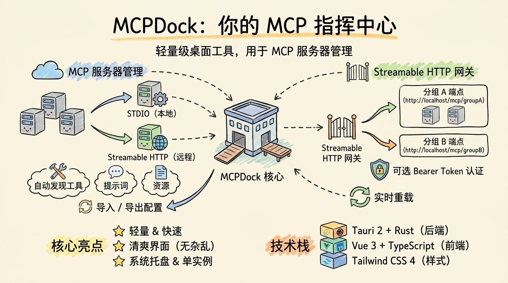

# MCPDock

**[English](README.md)**

一款轻量、简洁的桌面端工具，用于管理、监控和对外暴露 MCP（Model Context Protocol）服务器。基于 **Tauri 2 + Vue 3 + Rust** 构建 — 体积小巧、启动迅速、界面清爽。

---

## MCPDock 是什么？

[MCP](https://modelcontextprotocol.io) 是一种开放协议，用于标准化应用程序如何向大语言模型（LLM）提供上下文。MCPDock 提供了一种可视化的、桌面原生（Desktop-native）的方式来：

- 统一管理所有 MCP 服务器
- 运行本地 HTTP 网关，将多个服务器聚合为分组端点
- 自动发现工具（Tools）、提示词（Prompts）和资源（Resources）
- 导入、导出和整理服务器配置

无需手动编辑 JSON 文件，即可获得清爽无冗余的界面、系统托盘集成、深色模式支持和中英文完整界面。设计宗旨是不打扰你的工作流。

## 产品概览



---

## 截图

### macOS

**MCP 服务器管理**

注册 STDIO 和 Streamable HTTP 服务器，单独连接/断开，并实时监控运行状态。


**分组 & 网关管理**

创建分组、分配服务器成员，并通过独立的 Streamable HTTP 端点对外暴露，支持可选的 Bearer 认证。


**设置**

配置网关端口、语言、工具名分隔符、认证 Token、代理、超时和保活机制。


### Windows

**Windows 下的 MCP 服务器管理**


---

## 产品亮点

- 🪶 **轻量小巧** — 基于 Tauri 2 和 Rust 构建的原生桌面应用，占用资源极少
- ⚡ **极速启动** — 冷启动几乎无感，状态实时同步
- 🧹 **界面清爽** — 无冗余、无干扰，核心功能一目了然
- 🌐 **双语支持** — 完整的中英文界面，自动检测系统语言

## 功能特性

### MCP 服务器管理

- **添加与配置** — 支持两种传输方式注册 MCP 服务器：
  - **STDIO** — 启动本地子进程（如 `npx`、`python`、`uvx`），支持命令参数和环境变量。
  - **Streamable HTTP** — 通过 HTTP 连接远程 MCP 服务器，支持自定义请求头。
- **连接 / 断开 / 切换** — 单独启动、停止或启用/禁用服务器。已启用的服务器会在应用启动时自动连接。
- **能力自动发现** — 连接成功后，自动发现并存储每个服务器的能力：
  - **Tools** — 可在内置工具运行器中直接调用
  - **Prompts** — 支持带参数查看和调用
  - **Resources & Resource Templates** — 静态 URI 和参数化 URI 模板
- **导入 / 导出** — 支持从 JSON 批量导入服务器，或将服务器列表导出以备份和分享。
- **搜索与过滤** — 按名称实时搜索服务器。
- **直接调用工具** — 在应用内部通过结构化表单直接调用已发现的工具。

### Streamable HTTP 网关

- **分组路由** — 每个 MCP 分组作为独立的 Streamable HTTP 端点暴露在 `http://localhost:{port}/mcp/{group_name}`。
- **可选 Bearer Token 认证** — 通过可配置的认证令牌保护所有网关端点。
- **工具名前缀** — 分组内不同服务器的工具名会自动加上服务器名前缀和可配置的分隔符，避免命名冲突（例如 `server__tool_name`）。
- **可配置端口** — 支持选择任意可用端口，设置修改或分组变更时实时重载。
- **CORS 支持** — 内置跨域响应头，方便浏览器端客户端调用。

### 分组管理

- **多服务器聚合** — 创建分组并分配成员，所有成员的工具/提示词/资源都可以通过该分组端点统一访问。
- **实时重载** — 分组创建、更新或删除时，网关自动重启。
- **成员快速切换** — 无需重建分组即可快速添加或移除服务器成员。

### 设置

| 设置项         | 说明                               | 默认值   |
| -------------- | ---------------------------------- | -------- |
| 语言           | 界面语言（中文 / 英文 / 跟随系统） | 跟随系统 |
| 主题           | 浅色 / 深色 / 跟随系统             | 跟随系统 |
| 网关端口       | 网关 HTTP 监听端口                 | 3000     |
| 分隔符         | 分组工具名前缀分隔符               | `__`     |
| 认证令牌       | 网关端点的 Bearer Token            | —        |
| 请求超时       | 连接和工具调用超时时间             | 60 秒    |
| 保活间隔       | 周期性 Ping 以保持连接活跃         | 禁用     |
| HTTP 代理      | Streamable HTTP 服务器的代理       | —        |
| 开机自启       | 系统启动时自动运行应用             | 关闭     |
| 启动时显示窗口 | 自启动后是否显示窗口               | 关闭     |

### 系统托盘

- 关闭窗口时隐藏到系统托盘，而非退出程序。
- 左键点击托盘图标或通过托盘菜单恢复窗口。
- macOS：窗口隐藏时 Dock 图标自动隐藏（Accessory 模式）。
- Windows：支持浅色和深色托盘菜单主题。

### 单实例运行

- 同时只能运行一个应用实例，重复启动会将已有窗口提到前台。

### 国际化

- 通过 `vue-i18n` 完整支持简体中文（zh-CN）和英文（en）。
- 语言可自动检测操作系统设置，也可手动切换。

### 外观

- 支持 **浅色 / 深色 / 跟随系统** 主题，使用 Tailwind CSS 4 构建。
- macOS 采用原生标题栏；Windows 采用自定义无边框样式，更加简洁。

---

## 技术栈

| 层级              | 技术                       |
| ----------------- | -------------------------- |
| 桌面框架          | Tauri 2                    |
| 后端              | Rust、axum、tokio、rmcp    |
| 数据库            | SQLite（rusqlite，嵌入式） |
| 前端              | Vue 3、TypeScript          |
| UI 组件           | naive-ui                   |
| 样式              | Tailwind CSS 4             |
| 状态管理          | Pinia                      |
| 代码检查 / 格式化 | Biome                      |
| 包管理器          | pnpm                       |

---

## 环境要求

- [Rust](https://www.rust-lang.org/tools/install)（最新稳定版）
- [Node.js](https://nodejs.org/) ≥ 18
- [pnpm](https://pnpm.io/installation) ≥ 8
- 平台相关的 [Tauri 前置条件](https://v2.tauri.app/start/prerequisites/)：
  - **macOS** — Xcode Command Line Tools
  - **Windows** — Visual Studio Build Tools 或 C++ Build Tools

---

## 快速开始

```bash
# 克隆并进入项目目录
git clone <repo-url> && cd mcpdock

# 安装依赖
pnpm install

# 开发模式运行（支持热重载）
pnpm tauri dev

# 构建生产版本
pnpm tauri build

# 格式化 / 代码检查
pnpm format
pnpm lint
```

## 安装说明

> **macOS 提示：** MCPDock 目前未使用 Apple Developer 证书签名。下载并将 `MCPDock.app` 移动到 `/Applications` 后，请在终端执行以下命令以移除隔离属性：
>
> ```bash
> xattr -rd com.apple.quarantine /Applications/MCPDock.app
> ```

---

## 项目架构

```
mcpdock
├── src/                        # Vue 3 前端
│   ├── components/             # 页面与布局组件
│   │   ├── AppSidebar.vue      # 导航侧边栏
│   │   ├── PageHeader.vue      # 页面标题与描述
│   │   ├── GatewayStatus.vue   # 网关状态指示器
│   │   ├── McpManagement.vue   # MCP 服务器列表与管理主页面
│   │   ├── GroupManagement.vue # MCP 分组管理
│   │   ├── SettingsPage.vue    # 应用设置
│   │   ├── mcp/                # MCP 相关子组件
│   │   │   ├── McpServerList.vue    # 带状态标识的服务器列表
│   │   │   ├── McpServerForm.vue    # 添加/编辑服务器表单
│   │   │   ├── McpImportView.vue    # JSON 导入/导出
│   │   │   └── McpToolRunner.vue    # 直接调用工具界面
│   │   └── group/              # 分组相关子组件
│   ├── stores/                 # Pinia 状态仓库
│   │   ├── mcp.ts              # MCP 服务器状态与 IPC 调用
│   │   ├── group.ts            # 分组状态与 IPC 调用
│   │   └── settings.ts         # 设置状态与 IPC 调用
│   ├── types/                  # TypeScript 类型定义
│   ├── i18n/                   # i18n 配置
│   └── locales/                # 语言包（zh-CN、en）
├── src-tauri/                  # Rust 后端
│   ├── src/
│   │   ├── main.rs             # 入口文件
│   │   ├── lib.rs              # Tauri 构建器：初始化、托盘、单实例、网关与 MCP
│   │   ├── state.rs            # 全局应用状态（数据库、运行时、客户端、设置、网关）
│   │   ├── commands/           # Tauri IPC 命令处理器
│   │   │   ├── mcp.rs          # 服务器增删改查、连接/断开、工具调用
│   │   │   ├── group.rs        # 分组增删改查 + 网关重启
│   │   │   ├── settings.rs     # 设置读写 + 网关重启
│   │   │   ├── gateway.rs      # 网关状态查询与重启
│   │   │   └── capability.rs   # 能力列表查询
│   │   ├── mcp/                # MCP 客户端管理
│   │   │   ├── runtime.rs      # 运行时状态与客户端持有类型
│   │   │   └── manager/        # 连接生命周期、发现、传输
│   │   │       ├── mod.rs      # 连接、断开、刷新、调用工具
│   │   │       ├── transport.rs # STDIO 与 Streamable HTTP 客户端创建
│   │   │       ├── discovery.rs # 工具/提示词/资源发现
│   │   │       └── runtime_state.rs # 运行时状态辅助与事件发送
│   │   ├── gateway/            # Streamable HTTP 网关
│   │   │   ├── server.rs       # Axum 服务器：按分组路由、认证中间件、CORS
│   │   │   └── handler/        # GroupHandler：工具、提示词、资源分发
│   │   └── db/                 # SQLite 数据库层
│   │       ├── mod.rs          # 表结构初始化
│   │       ├── mcp_server.rs   # MCP 服务器增删改查
│   │       ├── mcp_group.rs    # MCP 分组增删改查
│   │       ├── mcp_capability.rs # 已发现能力存储
│   │       └── app_settings.rs # 设置键值存储
│   ├── icons/                  # 应用图标（macOS、Windows、托盘）
│   └── tauri.conf.json         # Tauri 配置
├── biome.json                  # Biome 检查与格式化配置
└── package.json                # Node.js 项目清单
```

## 数据流

```
┌──────────────────────────────────────────────────────────┐
│                    前端 (Vue 3)                          │
│  McpManagement ──→ Pinia stores ──→ Tauri IPC invoke()   │
└──────────────────────────┬───────────────────────────────┘
                           │ ipc
┌──────────────────────────▼───────────────────────────────┐
│                后端 (Rust / Tauri)                       │
│  commands/*.rs ──→ mcp/manager ──→ rmcp client          │
│                 ──→ gateway/server (axum)                 │
│                 ──→ db/* (rusqlite)                       │
└──────────────────────────────────────────────────────────┘
```

### 网关请求流程

```
客户端 → POST http://localhost:3000/mcp/my-group (Streamable HTTP)
    → Axum 路由
    → 认证中间件（Bearer Token 校验）
    → GroupHandler::call_tool
        → 解析带前缀的工具名 → 定位所属服务器
        → 获取或连接上游 MCP 客户端
        → 转发调用 → 返回结果
```

---

## 许可证

MIT
